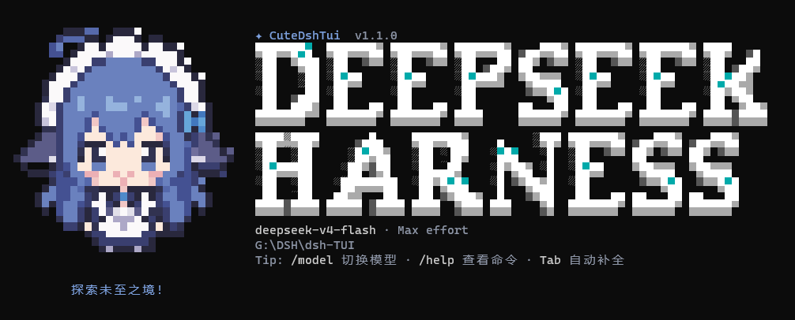

<p align="center">
  
</p>

<h1 align="center">CuteDshTui</h1>

<p align="center">A terminal-native interface for DeepSeek Harness.<br>Run <code>cdsh</code> from any project on Windows, Linux, or macOS.</p>

<p align="center">
  <a href="https://www.npmjs.com/package/@heluo0991/cute-dsh-tui"></a>
  <a href="https://github.com/Heluo0991/cute-dsh-tui"></a>
  <a href="LICENSE"></a>
  <a href="README.md"></a>
</p>

> Independently maintained community software; it is not affiliated with or endorsed by DeepSeek Harness.

## Highlights

- Terminal-native chat, Markdown, tool cards, file references, and command completion.
- Messages wordmark, pixel mascot, and a one-time startup shimmer that settles without continuous repainting.
- Two-stage `/model`: choose a model and then its reasoning depth; Max briefly lights the input border.
- `/resume`, `/new`, `/compact`, `/export`, fork-aware recovery, `/btw`, and profile plugin management.

## TUI screenshot

This is a real captured first screen; the mascot and wordmark are rendered by the TUI.

<p align="center">
  
</p>

## Deploy

### New user

Requires Node.js `^22.19 || >=24` and an interactive terminal. CuteDshTui packages the DSH and pnpm runtime it needs and does not overwrite the official `dsh` command.

```sh
npm install -g @heluo0991/cute-dsh-tui
cdsh
```

Run `cdsh` from any project thereafter. Its first launch creates the isolated `cute-dsh-tui` profile. No batch-file copying, manual PATH edits, or global pnpm install is required. `cute-dsh-tui` remains a compatibility alias.

### Existing DSH user

Your official `dsh` remains unchanged:

```sh
npm install -g @heluo0991/cute-dsh-tui
cdsh
```

Continue to manage other profiles with `dsh plugin --profile <name> ...`. CuteDshTui uses `$DSH_HOME/profiles/cute-dsh-tui`; DSH sessions remain under `$DSH_HOME/sessions`; UI preferences live in `~/.cute-dsh-tui`.

## API key and `/login`

Use `/login` inside the TUI and paste the DeepSeek API key into its masked field.

- If `DEEPSEEK_API_KEY` already exists in the terminal, DSH treats it as a read-only launch source. `/login` shows its status; change it in the shell and restart `cdsh` so the UI never reports a credential the model cannot use.
- If no terminal key exists, it asks before saving. Windows saves a user environment variable; macOS/Linux use DSH's owner-only `$DSH_HOME/.credentials.yaml` store, available to both `cdsh` and official `dsh`.
- Declining save keeps the key only until this TUI exits. `/logout` clears the session key and can remove a key previously saved by CuteDshTui; it never deletes a shell-provided key.
- An explicit environment variable always has priority, which is ideal for CI and secret managers.

Temporary shell configuration:

```sh
export DEEPSEEK_API_KEY='your-key' # Linux/macOS
```

```powershell
$env:DEEPSEEK_API_KEY = 'your-key' # current Windows PowerShell window
```

On Windows, `setx DEEPSEEK_API_KEY "your-key"` creates a user-level value for newly opened terminals. Do not commit keys, put them in project files, or use a system-level environment variable.

## Use

Start inside the target project; its directory becomes the default workspace.

| Goal | Command or shortcut |
| --- | --- |
| All commands | `/help` |
| Login or update this session key | `/login` |
| Choose model and reasoning depth | `/model` |
| Resume a session | `/resume` or `cdsh --resume` |
| New, compact, export | `/new`, `/compact`, `/export` |
| Ask beside the main transcript | `/btw <question>` |
| Inspect/manage profile plugins | `/plugin list`, `/plugin search <term>` |
| Change permissions | `Shift+Tab` or `/permission` |
| Appearance and language | `/theme`, `/lang`, `/activity` |

`--continue` / `-c` resumes the latest session; `--yolo` requests `danger-full-access`. `CUTE_DSH_TUI_WORKSPACE=/path/to/project` selects a workspace consistently on all supported systems.

## Update and platforms

Use `/update` in the TUI or run:

```sh
npm install -g @heluo0991/cute-dsh-tui@latest
```

`cdsh` is a Node CLI, not a Windows batch-file workflow. It supports Windows, Linux, and macOS on compatible x64/arm64 Node platforms. `cute-dsh-tui.cmd` is retained only for old checkout compatibility.

More: [Getting started](docs/getting-started.en.md) · [Interaction reference](docs/interaction.en.md) · [Configuration](docs/configuration.en.md) · [Architecture](docs/architecture.en.md)

## Development

```sh
git clone https://github.com/Heluo0991/cute-dsh-tui.git
cd cute-dsh-tui
pnpm install --frozen-lockfile
pnpm run build
pnpm run smoke
```

## License and acknowledgements

CuteDshTui is released under the [MIT License](LICENSE). It originally evolved from a framework fork of [ccch1mneyyy/dsh-TUI](https://github.com/ccch1mneyyy/dsh-TUI); thanks to that project and its contributors. Required upstream notices remain in distributed material.
