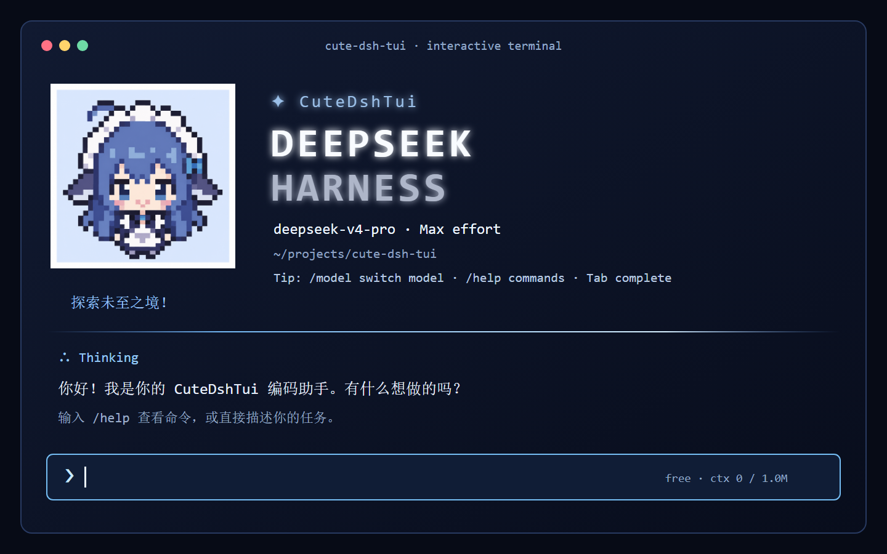

<p align="center">
  
</p>

<p align="center">
  
</p>

<h1 align="center">CuteDshTui</h1>

<p align="center">
  A terminal-native interface for DeepSeek Harness.<br>
  Start it from any compatible Windows, Linux, or macOS terminal.
</p>

<p align="center">
  <a href="https://www.npmjs.com/package/@heluo0991/cute-dsh-tui"></a>
  <a href="https://github.com/Heluo0991/cute-dsh-tui"></a>
  <a href="LICENSE"></a>
  <a href="README.md"></a>
</p>

> An independently maintained community project. It is not affiliated with or endorsed by DeepSeek Harness.

## Highlights

- Terminal-native chat, Markdown, tool cards, file references, and command completion.
- A Messages wordmark, CuteDeepSeek pixel mascot, and one-time startup shimmer that settles without continuous repainting.
- Two-stage `/model`: choose a model, then its reasoning depth. A Max switch briefly lights the input border.
- `/resume`, `/new`, `/compact`, and `/export`, with fork-aware session recovery.
- `/btw <question>` for a parallel side question and `/plugin` for current-profile plugin management.
- Visible thinking/activity state, context, approvals, themes, and Agent presets.

## Deploy

### New user: DSH is not installed yet

You need Node.js `^22.19 || >=24`, an interactive terminal TTY, and a DeepSeek API key. The following works on Windows, Linux, and macOS:

```sh
npm install -g @deepseek-ai/dsh @heluo0991/cute-dsh-tui pnpm@latest
cute-dsh-tui
```

The first run creates the `cute-dsh-tui` profile and installs the current plugin version. Afterwards, enter your project directory and run `cute-dsh-tui`.

Set the API key for the current Linux/macOS shell:

```sh
export DEEPSEEK_API_KEY='your-key'
```

For the current Windows PowerShell window:

```powershell
$env:DEEPSEEK_API_KEY = 'your-key'
```

### Existing DSH user: add the plugin

`dsh plugin` uses pnpm to manage profiles; use pnpm 10 or newer.

```sh
npm install -g pnpm@latest   # only when pnpm is absent
dsh plugin --profile cute-dsh-tui add @heluo0991/cute-dsh-tui
dsh --profile cute-dsh-tui
```

This leaves other DSH profiles untouched. Profile configuration lives in `$DSH_HOME/profiles/cute-dsh-tui/cordis.patch.yml`; sessions stay in `$DSH_HOME/sessions`; UI preferences live in `~/.cute-dsh-tui`.

### Update

Run `/update` inside the TUI, or:

```sh
dsh plugin --profile cute-dsh-tui update --latest @heluo0991/cute-dsh-tui
```

## Use it

Start from the target project directory: it becomes the Agent's default workspace.

| Goal | Command or shortcut |
| --- | --- |
| See all available commands | `/help` |
| Pick a model and reasoning depth | `/model` |
| Restore a saved session | `/resume` or `cute-dsh-tui --resume` |
| Create, compact, or export a session | `/new`, `/compact`, `/export` |
| Ask without changing the main transcript | `/btw <question>` |
| Inspect or manage profile plugins | `/plugin list`, `/plugin search <term>` |
| Change permissions | cycle with `Shift+Tab`, or choose with `/permission` |
| Change appearance or language | `/theme`, `/lang`, `/activity` |

`--continue` (or `-c`) resumes the latest session; `--yolo` requests `danger-full-access`. Set `CUTE_DSH_TUI_WORKSPACE=/path/to/project` to start a chosen project from another directory; this works consistently on Windows, Linux, and macOS.

## Platform support

CuteDshTui ships as a Node CLI, not as a Windows batch file. It runs natively wherever compatible Node, npm, pnpm, DSH, and an interactive TTY are available: Windows, Linux, and macOS on supported x64/arm64 Node platforms. CI validates the build and credential-free installation path on Ubuntu and macOS. `cute-dsh-tui.cmd` remains only as a checkout compatibility wrapper for Windows.

More documentation: [Getting started](docs/getting-started.en.md) · [Interaction reference](docs/interaction.en.md) · [Configuration](docs/configuration.en.md) · [Architecture](docs/architecture.en.md)

## Development

```sh
git clone https://github.com/Heluo0991/cute-dsh-tui.git
cd cute-dsh-tui
pnpm install --frozen-lockfile
pnpm run build
pnpm run smoke
```

Before a release run `pnpm run verify:permissions`, `pnpm run verify:launcher`, `pnpm run verify:inline-thinking`, and `npm pack --dry-run`.

## License and acknowledgements

This project is released under the [MIT License](LICENSE). CuteDshTui originally evolved from a framework fork of [ccch1mneyyy/dsh-TUI](https://github.com/ccch1mneyyy/dsh-TUI); thank you to that project and its contributors.

Required upstream copyright and license notices remain in distributed material.
